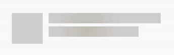

# ShimmerLayout

Memory efficient, simple yet highly customizable Shimmer Layout.

## About

`ShimmerLayout` can be used to create a shimmer effect to your Android apps loading states (similar to Facebook).

To allow better rendering on complex layouts (especially in `RecyclerView`), multiple `ShimmerLayout` can easily be synced together to use the exact same animation.

This implementation is very memory efficient, contrary to the most common implementations, it works without creating any Bitmaps or large objects. Rendering of the shimmer effect is also done in a single native operation, making its impact CPU and GPU usage very low.


Originally inspired by [Facebook Shimmer for Android](https://github.com/facebook/shimmer-android) and [Supercharge ShimmerLayout](https://github.com/team-supercharge/ShimmerLayout).

## Usage

// TODO gradle

Wrap the layout you want to animate inside a `ShimmerLayout`. It is recommended to define a layout that looks like the content you're going to display:
```xml
<xyz.peridy.shimmerlayout.ShimmerLayout
    android:id="@+id/shimmer_layout"
    android:layout_width="wrap_content"
    android:layout_height="wrap_content">

    <LinearLayout
        android:layout_width="match_parent"
        android:layout_height="wrap_content"
        android:orientation="horizontal"
        android:padding="16dp">

        <View
            android:layout_width="42dp"
            android:layout_height="42dp"
            android:background="@color/shimmerBackground"/>

        <LinearLayout
            android:layout_width="match_parent"
            android:layout_height="wrap_content"
            android:orientation="vertical">

            <View
                android:layout_width="152dp"
                android:layout_height="14dp"
                android:layout_marginLeft="8dp"
                android:layout_marginStart="8dp"
                android:background="@color/shimmerBackground"/>

            <View
                android:layout_width="122dp"
                android:layout_height="14dp"
                android:layout_marginLeft="8dp"
                android:layout_marginStart="8dp"
                android:layout_marginTop="4dp"
                android:background="@color/shimmerBackground"/>

        </LinearLayout>

    </LinearLayout>

</xyz.peridy.shimmerlayout.ShimmerLayout>
```

For the most basic usage, that's all you have to do. When this layout is visible, it will start animating. It will automatically stop or start again when its visibility change.

`ShimmerLayout` should work on any view, but since it's intended to be used as a loading indicator, you should keep them simple. Animated content can also be used in some cases (see `EvaluatorsDemoActivity`):

## Customization

### Default shimmer effect

By default, `ShimmerLayout` will create an effect based those parameters
- shimmerAngle: shadow angle
- shimmerWidth: total width of shadow
- shimmerCenterWidth: width of solid color in the center of shadow

All these can be set directly in xml layout:

```xml
<xyz.peridy.shimmerlayout.ShimmerLayout
    xmlns:app="http://schemas.android.com/apk/res-auto"
    android:layout_width="wrap_content"
    android:layout_height="wrap_content"
    app:shimmer_center_width="10dp"
    app:shimmer_width="20dp"
    app:angle="30">
```

### Groups

Groups allow multiple `ShimmerLayout` to be synchronized with each other. It is highly recommended to use a group if using ShimmerLayout on multiple elements on the screen (in a RecyclerView for example), as if new elements are added, their animation would not be synced with existing ones:

Without Group, if some views are added after animation is started (scrolling in a `RecyclerView` for example), you can end up in cases like this:


With a group, all views can be synchronizes together, no matter when they're added:


To set a group, simply define a `ShimmerGroup` object in code, and pass it to all `ShimmerLayout` you want to synchronise:
```kotlin
val myShimmerGroup = ShimmerGroup()

findViewById<ShimmerLayout>(R.id.shimmer_layout_1).shimmerGroup = myShimmerGroup
findViewById<ShimmerLayout>(R.id.shimmer_layout_2).shimmerGroup = myShimmerGroup
```

For the most common use (in RecyclerView), it is recommended to define the group in the adapter, and pass it to all ViewHolders (see demo app).

Multiple layouts using the same `ShimmerGroup` must use the same animation duration and `TimeInterpolator`.

### Evaluators

`ShimmerLayout` draws the effect on every frame using a single [drawPaint](https://developer.android.com/reference/android/graphics/Canvas.html#drawPaint\(android.graphics.Paint\)) operation. `ShimmerLayout` provides 3 ways to customize animation though `Evaluator` classes. Each of these expose a method that is called on each frame to customize the effect, so be mindful of performance when implementing them.

For example, this customizes the effect to use a radial gradient, growing and shrinking form the center of the view:
```kotlin
matrixEvaluator = null
timeInterpolator = CycleInterpolator(1f)
setShaderEvaluator { fraction ->
    val radius = Math.abs(fraction) * width + 1
    RadialGradient(width / 2f, height / 2f, radius, intArrayOf(Color.BLACK, Color.TRANSPARENT), null, Shader.TileMode.CLAMP)
}
colorEvaluator = object : ShimmerLayout.Evaluator<Int> {
    val evaluator = ArgbEvaluator()
    val colours = arrayOf("#B00000", "#00B000", "#0000B0").map { Color.parseColor(it) }
    val count = colours.size

    override fun evaluate(fraction: Float): Int {
        val localFraction = (1 + fraction) / 2 // CycleInterpolator means fraction ranges from -1 to 1
        val arrayPosition = (localFraction * count).toInt() % count
        val offset = localFraction * count % 1.0f
        return evaluator.evaluate(offset, colours[arrayPosition], colours[(arrayPosition + 1) % count]) as Int
    }
}
```



#### Shader Evaluator

The shader is used to create the shadow effect on `ShimmerLayout`. Using a custom `Evaluator<Shader>` allows you to customize the shader to use for each animation frame.

See example above for `RadialGradient`

#### Color Evaluator
By default, `ShimmerLayout` will use the `shimmerColor` attribute to tint the effect. Providing a custom `Evaluator` allows to define the color to use for each animation offset. For example, the following code rotates between 3 colors, using an `ArgbEvaluator` to smoothly transition from one to another:

See example above for use of `ArgbEvaluator` to alternate between multiple colours.

#### Matrix Evaluator

Default Matrix uses a translation from left to right, this can be modified by providing a custom `Evaluator<Matrix>`. For example, this replaces the translation with a rotation:
```kotlin
val matrix = Matrix()
setMatrixEvaluator { fraction ->
    matrix.apply {
        setRotate(fraction * 360)
    }
}
```

## License

BSD License

Copyright (c) 2017, Romain Peridy
All rights reserved.

Redistribution and use in source and binary forms, with or without modification, are permitted provided that the following conditions are met:

* Redistributions of source code must retain the above copyright notice, this list of conditions and the following
  disclaimer.

* Redistributions in binary form must reproduce the above copyright notice, this list of conditions and the following
  disclaimer in the documentation and/or other materials provided with the distribution.

THIS SOFTWARE IS PROVIDED BY THE COPYRIGHT HOLDERS AND CONTRIBUTORS "AS IS" AND ANY EXPRESS OR IMPLIED WARRANTIES,
INCLUDING, BUT NOT LIMITED TO, THE IMPLIED WARRANTIES OF MERCHANTABILITY AND FITNESS FOR A PARTICULAR PURPOSE ARE
DISCLAIMED. IN NO EVENT SHALL THE COPYRIGHT HOLDER OR CONTRIBUTORS BE LIABLE FOR ANY DIRECT, INDIRECT, INCIDENTAL,
SPECIAL, EXEMPLARY, OR CONSEQUENTIAL DAMAGES (INCLUDING, BUT NOT LIMITED TO, PROCUREMENT OF SUBSTITUTE GOODS OR
SERVICES; LOSS OF USE, DATA, OR PROFITS; OR BUSINESS INTERRUPTION) HOWEVER CAUSED AND ON ANY THEORY OF LIABILITY,
WHETHER IN CONTRACT, STRICT LIABILITY, OR TORT (INCLUDING NEGLIGENCE OR OTHERWISE) ARISING IN ANY WAY OUT OF THE USE OF
THIS SOFTWARE, EVEN IF ADVISED OF THE POSSIBILITY OF SUCH DAMAGE.