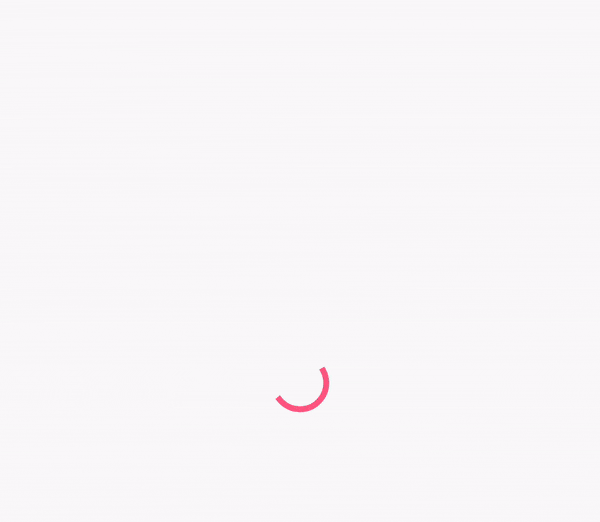

# ShimmerLayout

Simple, memory efficient and high performance Shimmer Layout for Android.

## About

`ShimmerLayout` can be used to create a shimmer effect to your Android apps loading states (similar to Facebook).

As loading states should be as fast and seamless as possible, this library leaves as much resources as possible for you to do the real work behind, by focusing on:

- memory efficiency: contrary to other similar libraries that usually work using multiple large bitmaps, this library **does not use a single bitmap** or large object, making its memory footprint negligible.
- performance: on top of avoiding large bitmap manipulation, rendering of each shimmer effect frame is done using **one single native operation**, making its impact on CPU and GPU usage as low as possible.
- simplicity: `View.setVisibility()` is all you need to control this layout.
- lightweight: just over 150 methods and around 20Kb, *before* proguard does its magic.

`ShimmerLayout` also offers a unique feature allowing better rendering on complex layouts (especially when used in `RecyclerView` as a placeholder for each `ViewHolder`): multiple `ShimmerLayout` can easily be synchronized together to use the exact same animation.

Despite its simplicity and small size, `ShimmerLayout` can still be configured for much more complex use cases thanks to a few optional parameters.

Simple use case with default animation, in a `RecyclerView` allowing scrolling while elements are still loading:


And a more complex loading screen using `ShimmerLayout` to create a color-changing, rotating shimmer effect on some animated views (in less than 20 lines!):



Originally inspired by [Facebook Shimmer for Android](https://github.com/facebook/shimmer-android) and [Supercharge ShimmerLayout](https://github.com/team-supercharge/ShimmerLayout).

## Usage

Use gradle to get latest version, custom maven URL is needed for now pending inclusion in bintray jCenter:

```groovy
repositories { maven { url "https://dl.bintray.com/rnpy/shimmer" } }

implementation 'xyz.peridy.shimmer:shimmerlayout:1.0'
```

Wrap the layout you want to animate inside a `ShimmerLayout`. It is recommended to define a layout that looks like the content you're going to display:

```xml
<xyz.peridy.shimmerlayout.ShimmerLayout
    android:id="@+id/shimmer_layout"
    android:layout_width="wrap_content"
    android:layout_height="wrap_content">

    <LinearLayout
        android:layout_width="match_parent"
        android:layout_height="wrap_content"
        android:orientation="horizontal"
        android:padding="16dp">

        <View
            android:layout_width="42dp"
            android:layout_height="42dp"
            android:background="@color/shimmerBackground"/>

        <LinearLayout
            android:layout_width="match_parent"
            android:layout_height="wrap_content"
            android:orientation="vertical">

            <View
                android:layout_width="152dp"
                android:layout_height="14dp"
                android:layout_marginLeft="8dp"
                android:layout_marginStart="8dp"
                android:background="@color/shimmerBackground"/>

            <View
                android:layout_width="122dp"
                android:layout_height="14dp"
                android:layout_marginLeft="8dp"
                android:layout_marginStart="8dp"
                android:layout_marginTop="4dp"
                android:background="@color/shimmerBackground"/>

        </LinearLayout>

    </LinearLayout>

</xyz.peridy.shimmerlayout.ShimmerLayout>
```

For the most basic usage, that's all you need. When this layout is visible, it will start animating. It will automatically stop or start again when its visibility change, since it's intended to be a loading placeholder, you're probably already doing this anyway.

`ShimmerLayout` should work on any view, but remember this is only a loading indicator, and keep things simple. Animated content can also be used in some cases, just make sure to make it as lightweight as possible and use native Android animations (see `EvaluatorsDemoActivity`):

## Customization

### Basic configuration

By default, `ShimmerLayout` will create an effect based those parameters
- shimmerAngle: shadow angle
- shimmerWidth: total width of shadow
- shimmerCenterWidth: width of solid color in the center of shadow
- shimmerDuration: duration in ms
- shimmerColor: color

All these can also be set directly in xml layout:

```xml
<xyz.peridy.shimmerlayout.ShimmerLayout
    xmlns:app="http://schemas.android.com/apk/res-auto"
    android:layout_width="wrap_content"
    android:layout_height="wrap_content"
    app:shimmer_center_width="10dp"
    app:shimmer_width="20dp"
    app:shimmer_angle="30"
    app:shimmer_duration="250"
    app:shimmer_color="#FF0000">
```

### Groups

Groups allow multiple `ShimmerLayout` to be synchronized with each other. It is highly recommended to use a group when using multiple `ShimmerLayout` on the same screen.

Without Group, if new `ShimmerLayout` are added after animation is started (scrolling down a `RecyclerView` for example), you can end up in cases like this, which would make your designers cry:


With a group, newly added views are synchronized with any existing one, making designers much happier:


To set a group, simply create a `ShimmerGroup` object in code, and pass it to all `ShimmerLayout` you want synchronised:
```kotlin
val myShimmerGroup = ShimmerGroup()

findViewById<ShimmerLayout>(R.id.shimmer_layout_1).shimmerGroup = myShimmerGroup
findViewById<ShimmerLayout>(R.id.shimmer_layout_2).shimmerGroup = myShimmerGroup
```

For the most common use (in `RecyclerView`), it is recommended to define the group in the adapter, and pass it to all ViewHolders (see demo app).

### TimeInterpolator

A [TimeInterpolator](https://developer.android.com/reference/android/animation/TimeInterpolator.html) can be provided to modify the rate of change of the animation. For example, to have the shimmer accelerate then decelerate, simply use:
```kotlin
shimmerLayout.timeInterpolator = AccelerateDecelerateInterpolator()
```

### Evaluators

`ShimmerLayout` draws the effect on every frame using one single [drawPaint](https://developer.android.com/reference/android/graphics/Canvas.html#drawPaint\(android.graphics.Paint\)) operation. `ShimmerLayout` provides 3 ways to customize animation though `Evaluator` classes. Each of these expose a method that is called on each frame to customize the effect, so be mindful of performance when implementing them.

For example, this customizes the effect to use a color-changing radial gradient instead of the default linear gradient, growing and shrinking from the center of the view instead of using a translation from left to right:
```kotlin
matrixEvaluator = null
timeInterpolator = CycleInterpolator(1f)
setShaderEvaluator { fraction ->
    val radius = Math.abs(fraction) * width + 1
    RadialGradient(width / 2f, height / 2f, radius, intArrayOf(Color.BLACK, Color.TRANSPARENT), null, Shader.TileMode.CLAMP)
}
colorEvaluator = object : ShimmerLayout.Evaluator<Int> {
    val evaluator = ArgbEvaluator()
    val colours = arrayOf("#B00000", "#00B000", "#0000B0").map { Color.parseColor(it) }
    val count = colours.size

    override fun evaluate(fraction: Float): Int {
        val localFraction = (1 + fraction) / 2 // CycleInterpolator means fraction ranges from -1 to 1
        val arrayPosition = (localFraction * count).toInt() % count
        val offset = localFraction * count % 1.0f
        return evaluator.evaluate(offset, colours[arrayPosition], colours[(arrayPosition + 1) % count]) as Int
    }
}
```
And now your designers can cry again with this result:


#### Shader Evaluator

The shader is used to create the shadow effect. Providing one allows you to customize the shader to use for each animation frame.

See example above for use of a `RadialGradient`

#### Color Evaluator

The color used to tint the shadow effect. By default, `ShimmerLayout` will use the `shimmerColor` attribute to tint the effect. Providing an `Evaluator` allows you to define the color to use for each animation frame.

See example above for use of `ArgbEvaluator` to alternate between multiple colours.

#### Matrix Evaluator

Default Matrix uses a translation from left to right, this can be modified by providing a custom `Evaluator<Matrix>`. For example, this replaces the translation with a rotation (see `EvaluatorsDemoActivity` for an example using this):
```kotlin
val matrix = Matrix()
setMatrixEvaluator { fraction ->
    matrix.apply {
        setRotate(fraction * 360)
    }
}
```

## License

BSD License

Copyright (c) 2017, Romain Peridy
All rights reserved.

Redistribution and use in source and binary forms, with or without modification, are permitted provided that the following conditions are met:

* Redistributions of source code must retain the above copyright notice, this list of conditions and the following
  disclaimer.

* Redistributions in binary form must reproduce the above copyright notice, this list of conditions and the following
  disclaimer in the documentation and/or other materials provided with the distribution.

THIS SOFTWARE IS PROVIDED BY THE COPYRIGHT HOLDERS AND CONTRIBUTORS "AS IS" AND ANY EXPRESS OR IMPLIED WARRANTIES,
INCLUDING, BUT NOT LIMITED TO, THE IMPLIED WARRANTIES OF MERCHANTABILITY AND FITNESS FOR A PARTICULAR PURPOSE ARE
DISCLAIMED. IN NO EVENT SHALL THE COPYRIGHT HOLDER OR CONTRIBUTORS BE LIABLE FOR ANY DIRECT, INDIRECT, INCIDENTAL,
SPECIAL, EXEMPLARY, OR CONSEQUENTIAL DAMAGES (INCLUDING, BUT NOT LIMITED TO, PROCUREMENT OF SUBSTITUTE GOODS OR
SERVICES; LOSS OF USE, DATA, OR PROFITS; OR BUSINESS INTERRUPTION) HOWEVER CAUSED AND ON ANY THEORY OF LIABILITY,
WHETHER IN CONTRACT, STRICT LIABILITY, OR TORT (INCLUDING NEGLIGENCE OR OTHERWISE) ARISING IN ANY WAY OUT OF THE USE OF
THIS SOFTWARE, EVEN IF ADVISED OF THE POSSIBILITY OF SUCH DAMAGE.